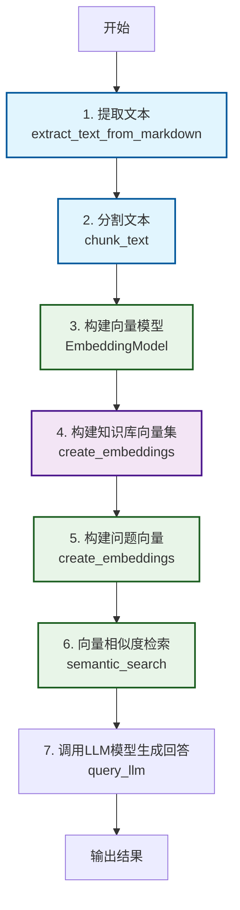
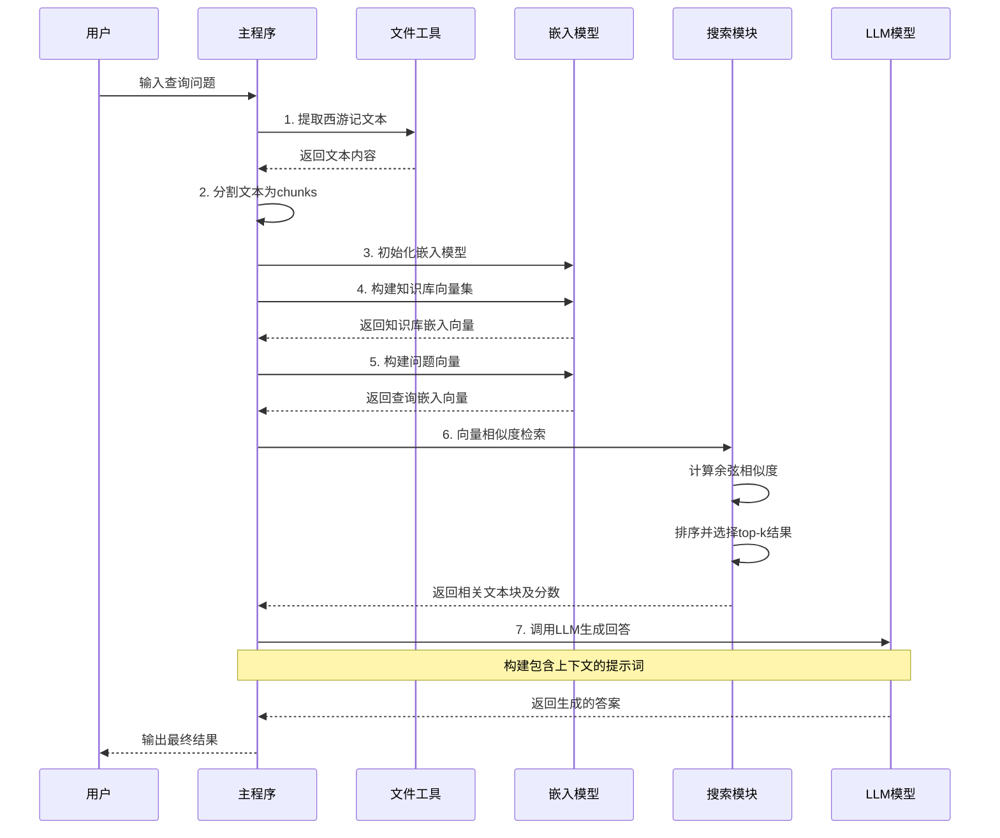

# RAG 流程图

## 流程图 (Flowchart)

## 时序图 (Sequence Diagram)

## 详细说明

### 流程图说明
1. **提取文本**: 从 `data/xiyouji.md` 文件中读取西游记文本内容
2. **分割文本**: 将长文本按固定大小和重叠度分割成多个文本块
3. **构建向量模型**: 初始化 Sentence Transformers 嵌入模型
4. **构建知识库向量集**: 将所有文本块转换为向量表示
5. **构建问题向量**: 将用户查询转换为向量表示
6. **向量相似度检索**: 计算查询向量与知识库向量的相似度，返回最相关的文本块
7. **调用LLM模型**: 将相关文本块作为上下文，生成最终答案

### 时序图说明
- 展示了各个组件之间的交互顺序
- 突出了数据流向和处理步骤
- 显示了异步处理和同步返回的关系
